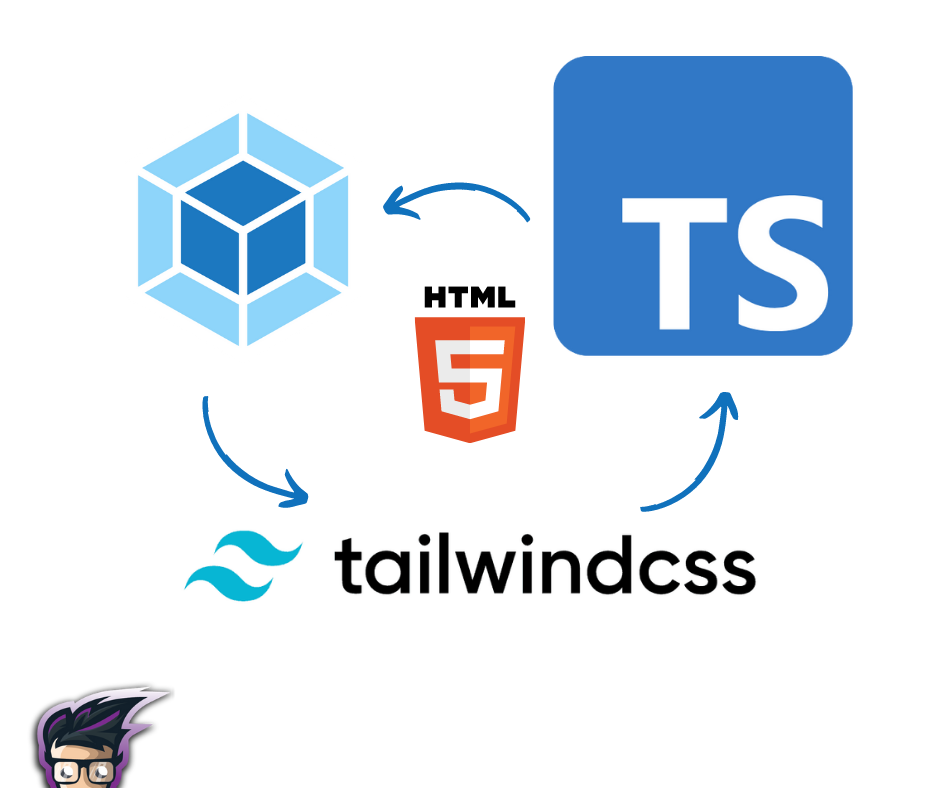

# webpack-typeScript-TailwindCSS

# TypeScript Webpack Tailwind CSS Starter

<div>
  
</div>

when I couldn't find a great typescript + webpack starter template that's minimal, up to date, and works! So I created this one.

## Usage
Clone the repository in your local machine. 
Run the following command to install the dependencies
```bash
npm install
# or
yarn
```

Then run the following command to start the dev server:
```bash
npm start
# OR
yarn start
```

## Build
To generate the production build, run the following command:
```bash
npm run build
# OR
yarn build
```

# License
[MIT](LICENSE)
